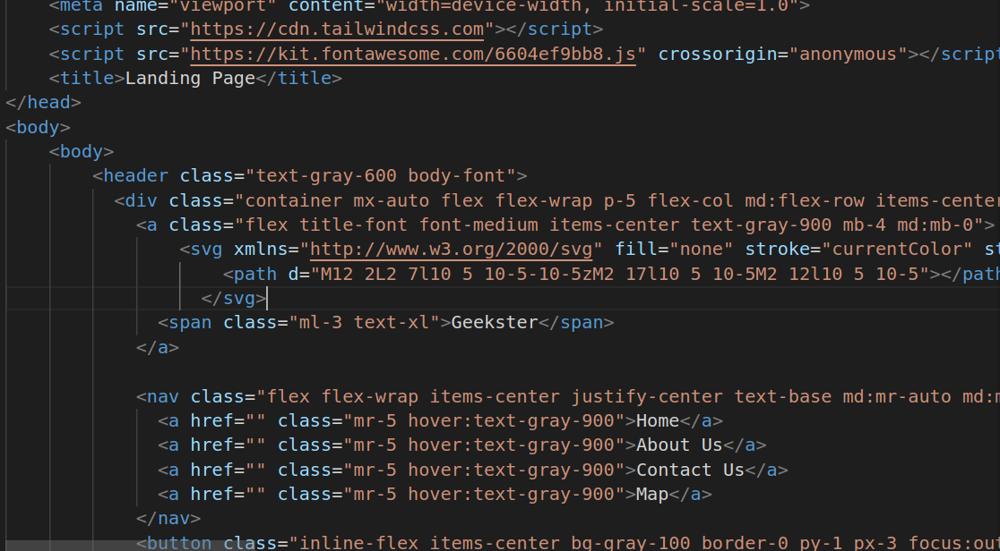
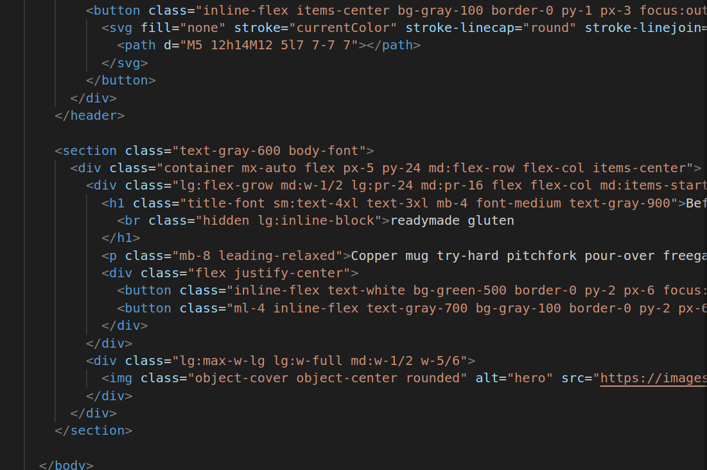

# Responsive Landing Page

1.

2.

* header class="text-gray-600 body-font": This header section represents the website's header. It uses Tailwind CSS classes for styling.
* div class="container mx-auto flex flex-wrap p-5 flex-col md:flex-row items-center": This div element is a container for the header content. It uses Tailwind CSS classes to create a responsive layout and align its child elements.
* a class="flex title-font font-medium items-center text-gray-900 mb-4 md:mb-0": This a element contains the website logo and title. It uses Tailwind CSS classes to style the logo and title.
* svg ...: This SVG element is used to display an icon (a circle with two diagonal lines) within the logo. It uses Tailwind CSS classes for sizing and coloring.
* span class="ml-3 text-xl": This span element displays the website's name "Geekster" next to the logo. It uses Tailwind CSS classes for styling.
* nav class="flex flex-wrap items-center justify-center text-base md:mr-auto md:ml-4 md:pl-4 md:border-l md:border-gray-500": This nav element represents the navigation menu. It uses Tailwind CSS classes for layout and alignment.
* a href="" class="mr-5 hover:text-gray-900" href="" class="mr-5 hover:text-gray-900" ,a href="" class="mr-5 hover:text-gray-900"Contact Us,a href="" class="mr-5 hover:text-gray-900" Map,a: These a,elements represent menu items such as Home, About Us, Contact Us, and Map. They use Tailwind CSS classes for styling, including hover effects.
* button class="inline-flex items-center bg-gray-100 border-0 py-1 px-3 focus:outline-none hover:bg-gray-200 rounded text-base mt-4 md:mt-0" ,Geek ,svg ...: This button element is a call-to-action button labeled "Geek" with an icon. It uses Tailwind CSS classes for styling, including background color, padding, hover effect, and rounded corners.
* section class="text-gray-600 body-font": This section element represents the main content section of the landing page. It uses Tailwind CSS classes for styling.
* div class="container mx-auto flex px-5 py-24 md:flex-row flex-col items-center": This div element serves as a container for the main content. It uses Tailwind CSS classes for layout and alignment.
* div class="lg:flex-grow md:w-1/2 lg:pr-24 md:pr-16 flex flex-col md:items-start md:text-left mb-16 md:mb-0 items-center text-center": This div represents a content section within the main content. It uses Tailwind CSS classes for responsive layout and alignment.
* h1 class="title-font sm:text-4xl text-3xl mb-4 font-medium text-gray-900" Before they sold out class="hidden lg:inline-block",readymade gluten,h1: This h1 element displays a headline with line breaks. It uses Tailwind CSS classes for text size, font weight, and margin.
* p class="mb-8 leading-relaxed"...: This p element contains descriptive text. It uses Tailwind CSS classes for margin and text leading (line spacing).
* div class="flex justify-center": This div element is used to center-align buttons.
* button class="inline-flex text-white bg-green-500 border-0 py-2 px-6 focus:outline-none hover:bg-indigo-600 rounded text-lg",Yes: This button element is labeled "Yes" and uses Tailwind CSS classes for styling, including text color, background color, padding, hover effect, and rounded corners.
* button class="ml-4 inline-flex text-gray-700 bg-gray-100 border-0 py-2 px-6 focus:outline-none hover:bg-gray-200 rounded text-lg">No button: This button element is labeled "No" and uses Tailwind CSS classes for styling, similar to the "Yes" button.
* div class="lg:max-w-lg lg:w-full md:w-1/2 w-5/6": This div element contains an image. It uses Tailwind CSS classes for responsive sizing.
* img class="object-cover object-center rounded" alt="hero" src="...": This img element displays an image with specified properties, such as object-fit and rounding of corners.

* color: This property defines the text color of an element. It can be set using color names (e.g., "red"), hexadecimal color codes (e.g., "#FF0000"), RGB values (e.g., "rgb(255, 0, 0)"), or HSL values (e.g., "hsl(0, 100%, 50%)"). In your code, text-gray-900 and text-white set the text color of elements to specific shades of gray and white, respectively.
* background-color: This property sets the background color of an element. It can be set using the same color notation methods as the color property. For example, bg-gray-100 and bg-gray-200 set the background color of buttons to shades of gray, while bg-green-500 sets it to green.
* border: The border property allows you to define the border of an element. You can set the border width, style, and color. In your code, border-0 removes the border, and border-2 sets a 2-pixel-wide border. You can also specify border colors using classes like border-black.
* padding: Padding is the space between an element's content and its border. It can be set using classes like py-2 and px-6, which define vertical and horizontal padding, respectively. The numeric values determine the amount of padding, and the unit is typically in "rem."
* margin: Margin is the space between elements. It can be set using classes like ml-3, mr-5, and mt-4, where the numeric values determine the amount of margin and the unit is "rem."
* font-size: This property determines the size of text. In your code, classes like text-xl and text-lg set the font size of text elements to extra-large and large, respectively.
* font-weight: The font-weight property defines the thickness of characters in a text element. Classes like font-bold set text to be bold.
* text-align: This property controls the horizontal alignment of text within an element. In your code, text-right right-aligns text.
* line-height: Line height defines the space between lines of text within an element. It can be set using classes like leading-relaxed.
* display: The display property controls how an element is displayed on the page. In your code, flex is used to create flexible layouts within elements.
* box-shadow: This property adds shadows to elements. In your code, shadow-lg applies a shadow to create a depth effect.
* width and height: These properties control the dimensions of elements. In your code, classes like w-5/6, h-45, and h-[110px] set the width and height of elements to specific values.
* position: The position property determines the positioning of an element within its container. In your code, bg-fixed is used to set the background as fixed.
* border-radius: This property defines the rounded corners of elements. In your code, rounded and rounded-full apply rounded corners to elements.
* object-fit: For images, the object-fit property controls how the image is resized to fit its container. It can be set to values like cover or contain
